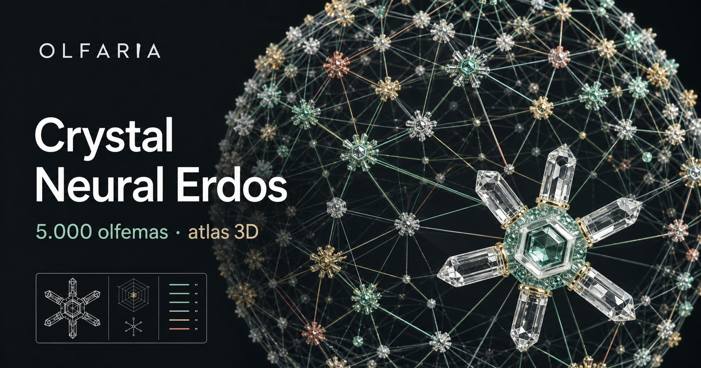
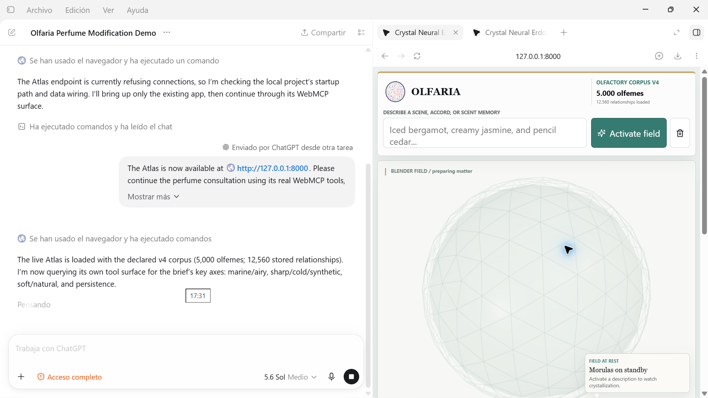

# Olfaria Crystal Atlas Neural Erdos

Olfaria turns a structured vocabulary of smell into a shared visual workspace for people and AI agents. Through WebMCP, an agent can search olfemes, inspect recorded relationships, compare concepts, find graph paths and focus the corresponding nodes in the same live 3D Atlas the person is exploring.

**Live application:** [noirway.nite.black/webmcpolfaria/](https://noirway.nite.black/webmcpolfaria/)

> The production demonstration is access-controlled. Judges can use the credentials supplied privately in the Devpost testing instructions. Other evaluators may request temporary access from [belduriel@gmail.com](mailto:belduriel@gmail.com). No production credential or secret is stored in this repository.

## Demo video

[](https://youtu.be/TO-C0kQ8yiQ)

[Watch the public 2:48 English demo on YouTube](https://youtu.be/TO-C0kQ8yiQ). A copy of the published master is also preserved in [`media/olfaria-webmcp-demo.mp4`](media/olfaria-webmcp-demo.mp4).

## ChatGPT integration



WebMCP keeps the human-visible Atlas and the model-facing tool surface synchronized. The agent works through typed tools registered by the authenticated page instead of guessing how to operate the 3D interface.

## Why WebMCP

Smell is difficult to search and explain because sensory language is ambiguous and contextual. Conventional browser automation would have to infer the meaning of a complex 3D interface. Olfaria exposes a narrow, stable contract: the agent retrieves structured evidence and then points to the exact concepts on screen, while the person retains visual control.

Together, a person and agent can move from a natural-language formulation problem to normalized olfemes, inspect provenance and uncertainty, compare concepts, trace graph paths and keep the relevant evidence visible. That combination of structured reasoning and shared visual context was difficult to achieve through UI automation alone.

## WebMCP tools

| Tool | Purpose | Side effect |
| --- | --- | --- |
| `search_olfemas` | Find corpus entries through bounded deterministic search | None |
| `get_relations` | Read recorded relationships for an olfeme | None |
| `compare_olfemas` | Compare two corpus records | None |
| `find_path` | Traverse existing relationships with bounded depth | None |
| `focus_nodes` | Focus matching nodes in the existing 3D Atlas | Current visual state only |

The first four tools are read-only. `focus_nodes` delegates to the Atlas controller and never changes corpus data.

## Implementation

The page registers five tools with `document.modelContext.registerTool`. Four call bounded FastAPI operations over immutable graph indexes. The fifth uses the existing `window.OlfariaAtlasApi` visual bridge. The adapter contains no independent olfactory inference logic, and the Atlas remains usable when WebMCP is unavailable.

```text
Authenticated browser session
        │
        ├── Crystal Neural Atlas (existing 3D interface)
        │       └── narrow visual controller
        │
        └── WebMCP adapter (five bounded tools)
                ├── four read operations → deterministic graph service
                └── focus_nodes → Atlas visual controller

Versioned corpus → validated immutable loader → deterministic indexes
```

See [Architecture and trust boundaries](docs/ARCHITECTURE.md), the [WebMCP contract](docs/WEBMCP.md) and the [hackathon development history](docs/DEVELOPMENT_HISTORY.md).

## Login and security boundary

The production deployment validates credentials server-side and creates a signed, time-bounded, `HttpOnly`, `SameSite=Strict` session cookie. Protected pages, graph endpoints and WebMCP registration require that session. Passwords, hashes, session keys, account lists and production corpus data remain outside Git.

## Repository scope

Included: implementation context, the WebMCP adapter and service design, required Atlas assets, architecture and security documentation, approved screenshots and the published demo video.

Excluded: the private 5,000-olfeme corpus, synthetic or production test datasets, production accounts, password hashes, signing keys, cookies, environment files, dependency/bootstrap files, local run instructions, capture scripts, test harnesses, raw recordings and deployment-specific archives. The public repository is intentionally not a local evaluation package; judges test the authenticated deployment.

## Scientific scope

Olfaria is a graph-based olfactory research and exploration system. Tool results must not be interpreted as chemical composition, safety, regulatory or sensory-validation claims. Corpus evidence is reported separately from deterministic technical inference.

## License

The public implementation is released under the [MIT License](LICENSE). Proprietary corpus data and private production configuration are not included.
